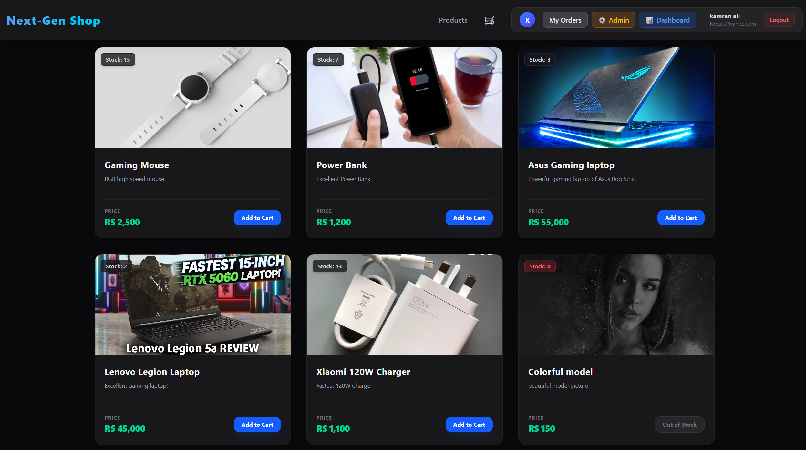
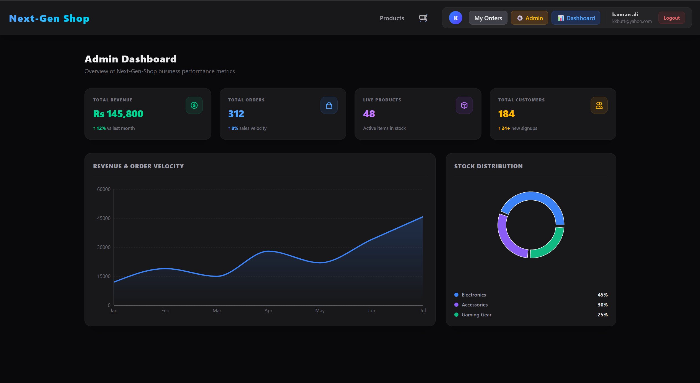
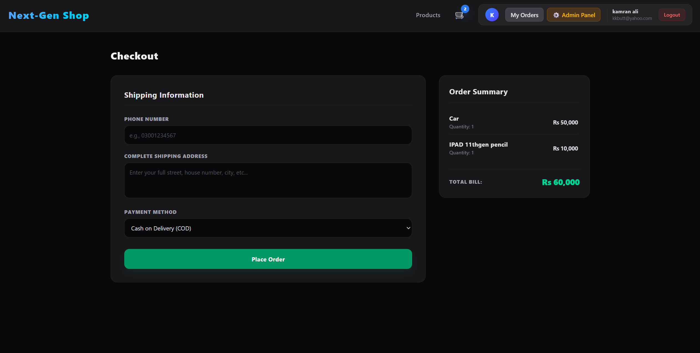
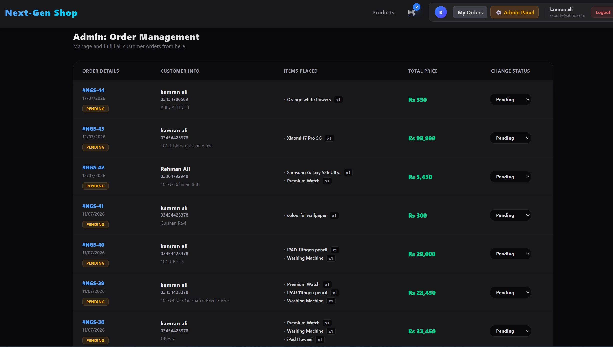

# 🛒 NEXT GEN SHOP (Front-End)

A modern, high-performance E-Commerce Client application built with **React** and styled with **Tailwind CSS**, featuring a premium Dark Theme UI and real-time interactive dashboards.

*   📊 **Interactive Admin Dashboard (Recharts / Graphs)**
*   ⚡ **Dynamic Client-Side Protected Routes (Role-Based)**
*   🛍️ **Fluid Product Catalog & Cart Experience**
*   🔄 **Global State Sync (Context API)**
*   🎨 **Premium Dark / Material UI Theme**
*   🚀 **Performance Optimized Rendering**

---

## 📸 Project Preview

### 🛍️ Product Catalog


### 📊 Admin Analytics & Dashboard Overview


---

## 🚀 Features

### 🔐 Authentication & Client-Side Security
*   **Role-Based Access Control:** Strict route guarding via customized wrapper components.
*   **Token-Based Persisted Session:** Keeps users securely logged in across page reloads.
*   **Dynamic UI Elements:** Context-aware Navbar that conditionally toggles User Profiles, Client Orders, and Admin controls.

### 🛍️ Customer Experience (UX)
*   **Instant Cart Actions:** Zero-latency cart badge rendering with pulse notifications on item updates.
*   **Responsive Checkout:** Fully fluid order placement forms optimized for mobile, tablet, and desktop screens.
*   **Order History Tracker:** Sleek UI interfaces tracking package tracking states from processing to complete.

*   ### 📊Checkout


### 📊 Admin Control Center
*   **Sales Analytics Graphs:** Interactive charts showing complex weekly sales data beautifully.
*   **Inventory Status Controls:** Real-time badge indicators for stock depletion (e.g., Out of Stock labels).
*   **Management Views:** Tabular layouts for quick CRUD lookups on orders, products, and active users.

*   ### 📊 Admin Orders


### ⚡ Performance Optimization
*   **Optimized Rendering:** Implementation of structural safeguards to minimize unnecessary component lifecycle flashes.
*   **Dynamic Squeeze Control:** Strategic use of text constraints (`whitespace-nowrap`, text truncation) preventing layout fragmentation across small viewports.
*   **Sticky Dynamic Layouts:** High-index (`z-50`) backdrop-blur glassmorphic floating navigational menus.

---

## 🛠️ Architecture & Tech Stack

*   **Core Engine:** React (Vite-Powered)
*   **Routing Architecture:** React Router DOM (Declarative Nested Routers)
*   **Global State Management:** Context API (Auth Context / Cart Context)
*   **Styling Engine:** Tailwind CSS & PostCSS
*   **Asynchronous Network Layer:** Axios (RESTful API consumption with Sanctum support)

---

## 💻 Getting Started (Local Installation)

1. **Clone the repository:**
   ```bash
   git clone [https://github.com/kamran-66/NextGen-Shop-frontend.git](https://github.com/kamran-66/NextGen-Shop-frontend.git)
